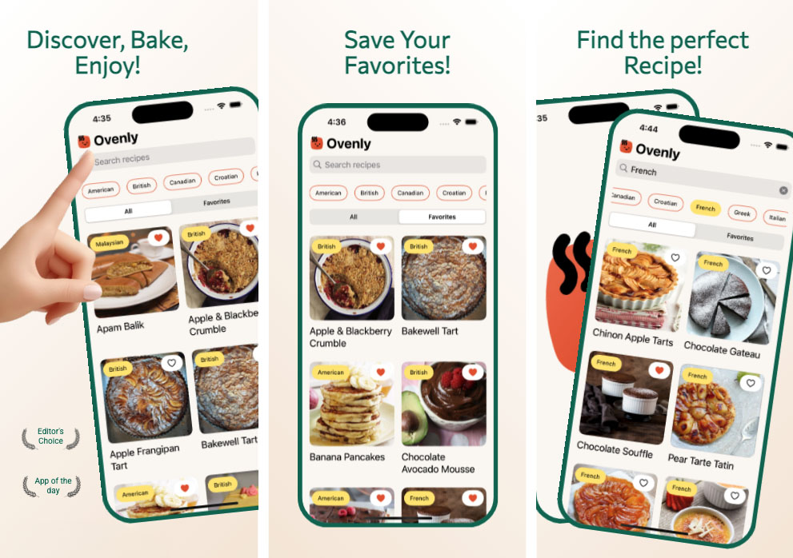
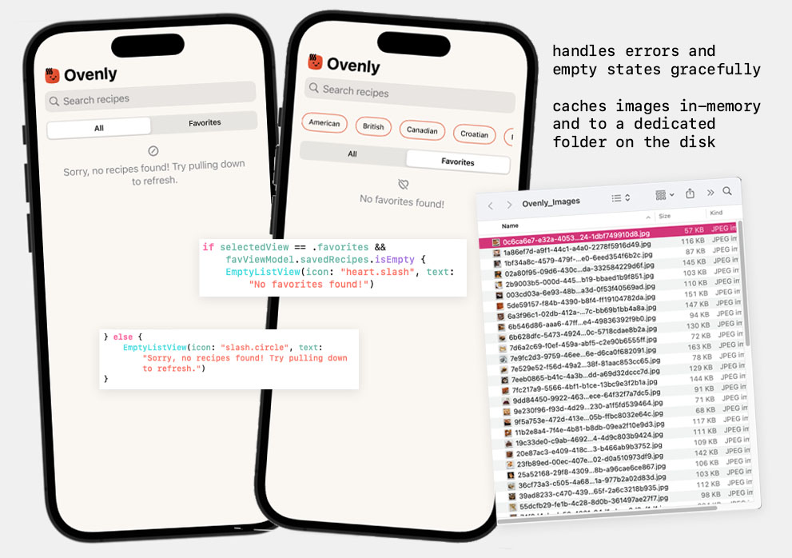

# 🍰 Ovenly – A Delightful Way to Discover & Save Baking Recipes  

## ✨ Summary  
Ovenly is a single-view portfolio SwiftUI app that helps users discover and save baking recipes sorted by regional cuisine. With a focus on smooth user experience and Swift Concurrency, Ovenly allows users to:  

- ✅ **Browse Baking Recipes** by regional cuisine with an intuitive UI.  
- ✅ **Search Recipes** using a search bar or by selecting cuisine-type chips.  
- ✅ **Save Favorites** to a personalized list for quick access.  
- ✅ **Pull to Refresh** for the latest recipes.  
- ✅ **Fast Image Loading** with a custom-built caching system for optimal performance.  

Ovenly is designed for **iOS 16+** and built entirely with **SwiftUI**. In addition, Ovenly is designed with **MVVM** architecutre for scalable data flow management and testing, and includes **accessibility features** for improved usability. 

## Screenshots



## Demo


## 🎯 Focus Areas  
I prioritized two key areas in this project:  

### 💡 User Interface & Experience  
- I focused on **polished UI interactions, delightful animations, and haptic feedback** to make the app engaging.  
- Baking is a joyful activity, and I wanted the app to reflect that joy in its design.  

### 🖼️ Efficient Image Caching
- Image loading was a UX bottleneck, so I implemented **both in-memory caching and disk caching** in addition to lazy loading and asyncImage to reduce unnecessary network requests.  
- This ensures a smooth browsing experience, even when scrolling through many recipes. 

## ⏳ Time Spent  
I dedicated **several days** to this project:

- 🛠 **Testing & Debugging** – A significant portion of my time was spent on writing and refining unit tests.  
- 📌 **Building the Favorites Feature** – Building the favorites feature was an exercise in saving to User Defaults, as well as a new level of unit testing.
- 🎨 **UI Enhancements** – I just love UI design, so I spent more time on a delightful design. 

Since I wanted to fully explore Swift Concurrency and SwiftUI, I took my time to build everything properly without rushing.  

## 🔄 Trade-offs and Decisions  
I didn’t make any major trade-offs because I dedicated extra time to the project. However:  

- **Hand-coding Image Caching** – Instead of using an external library (like Kingfisher), I implemented my own solution for image caching. This took **a lot of time**, but it was a valuable learning experience.  
- **Unit Testing** – While I wrote many tests, I know they could be cleaner. As I build more apps, I plan to refine my testing approach.  

## 🏗 Weakest Part of the Project  
- **Unit Testing** – While I aimed for solid test coverage, unit testing isn’t my strongest area. I tried to be thorough but would love to improve my ability to write better tests as I develop.  

## Additional Information  
### Meets All Requirements:  
- **Swift Concurrency (`async/await`)** for all async operations.  
- **No third-party dependencies** – fully built with Apple's frameworks.  
- **Custom Image Caching** – avoids redundant network calls.  
- **SwiftUI-Based UI** with iOS 16+ support.  
- **Unit Tests** covering core logic (data fetching, caching).  

### Future Enhancements:
- In production, I would meet with the app architect to decide if the favorites should also be saved to the same place as the images are cached, instead of to User Defaults.
- For future apps, I would still choose to use a third-party library for image caching in production to save development time.  

## Final Thoughts  
Ovenly was a fun and rewarding project! It allowed me to showcase my UI skills, explore Swift Concurrency, and practice manual image caching. While unit testing is an area I need to improve, I'm proud of the smooth user experience and thoughtful details built into the app.  


## 🚀 Built With  

- Swift 5
- SwiftUI
- Xcode 16.2 

### Installation  
1. Clone the repository:  
   ```bash
   git clone https://github.com/your-username/Ovenly.git
